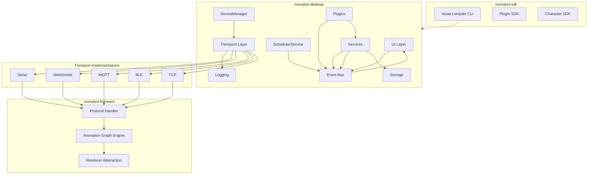

# Architecture

> **Status:** Design specification - implementation not yet started.

## Overview

NomaBot is a **platform**, not just a desk toy: a Python control plane, ESP32 render plane, asset pipeline, SDKs, and an extensible plugin/character ecosystem. The desktop application, firmware, SDK, and assets are designed to evolve **independently** with stable contracts between them.

```text
                    ┌─────────────────────────────────────┐
                    │           NomaBot Platform          │
                    └─────────────────────────────────────┘
         ┌──────────────┬──────────────┬──────────────┬──────────────┐
         ▼              ▼              ▼              ▼              ▼
   nomabot-desktop  nomabot-firmware  nomabot-sdk   nomabot-assets  docs
   (PySide6)        (ESP32)           (APIs, CLI)   (packs, themes)
```

During early development these may live in a **monorepo**; the target end state is **four repositories** with independent release cycles (see [Repository strategy](#repository-strategy)).

## Technology stack

| Component | Technology | Rationale |
|-----------|------------|-----------|
| Desktop runtime | Python 3.13 | Large ecosystem, fast iteration |
| Desktop UI | **PySide6 (Qt6) - from day one** | No interim UI framework; no migration debt |
| UI design | Qt Designer | Visual form layout |
| Firmware | Arduino Framework (ESP32) | Faster iteration than ESP-IDF for this scope |
| Renderer | **Renderer abstraction** → LovyanGFX backends | ST7789 today; OLED, AMOLED, HDMI ports later |
| Animation | Custom sprite engine + **animation graph** | Transition rules, not hard cuts |
| Communication | **Transport interface** → Serial, WebSocket, MQTT, BLE, TCP | Same JSON protocol everywhere |
| Assets | **Asset compiler CLI** | PNG → RGB565 → compress → manifest → device |
| Configuration | JSON | Human-readable, extensible |
| Local storage | SQLite | Settings, devices, plugin state, scheduler jobs |
| OTA updates | AsyncElegantOTA or native OTA | Wireless firmware updates |
| Packaging | Nuitka | Compile Python to native Windows executable |

### PySide6 from day one

NomaBot standardizes on **Python 3.13 + PySide6 + Qt Designer** from the first desktop milestone. There is no CustomTkinter, Tkinter, or “temporary UI” phase.

Migrating UI frameworks later means rewriting every window, dialog, settings page, and custom widget. PySide6 already provides native Windows UI, dark mode, system tray, dock widgets, tables, trees, charts, SVG, and animations. The only tradeoff is a slightly larger installer-acceptable for a product-grade app.

## Platform architecture

```text
                         Noma Core (desktop/core/)
                               │
                         Noma Runtime  ◄── central orchestrator (ADR 0004)
                               │
         ┌─────────────────────┼─────────────────────┐
         │                     │                     │
         ▼                     ▼                     ▼
    Event Bus            Device Manager        Scheduler
         │                     │                     │
    ┌────┴────┐           multi-device         cron-like jobs
    ▼         ▼                │                     │
 Services  Plugins              └──────────┬──────────┘
    │         │                           │
    └────┬────┘                           │
         │         submit RenderRequest    │
         └──────────────► Runtime ◄───────┘
                               │
                    Render queue (priority)
                    Animation queue (graph)
                               │
                               ▼
                         Transport Layer
                               │
                    Serial · WebSocket · MQTT · BLE · TCP
                               ▼
                          Firmware
                               │
                    Renderer abstraction
                               │
                    LILYGO T-Display S3 · …
```

**Golden rules:**

1. Plugins and services **submit to Noma Runtime**-never to transport or JSON directly.
2. Services **never import each other** - only the event bus and shared interfaces in `core/`.
3. Firmware **never** embeds domain logic (Git, Spotify, AI, …).
4. Every JSON message includes a **protocol version** field.

## Noma Runtime

**Noma Runtime** (internal name; not a separate product called "NomaOS") is the desktop **orchestration layer**-similar in role to a game engine tick routing subsystems.

```text
Desktop UI / Plugins / Services
              │
              ▼
         Event Bus
              │
              ▼
        Noma Runtime
              │
    ┌─────────┼─────────┐
    ▼         ▼         ▼
Scheduler  Render Q   Animation Q
  queue    (priority)  (graph events)
    │         │         │
    └─────────┴────┬────┘
                   ▼
            DeviceManager
                   ▼
              Transport
                   ▼
                ESP32
```

| Responsibility | Owner |
|----------------|-------|
| When to send | Scheduler + plugins (via events) |
| What wins | Runtime render queue ([priority](#event-priority-and-render-queue)) |
| How it looks | Animation queue → graph on firmware |
| Where it goes | DeviceManager per `device_id` |
| Wire format | Transport serializes JSON `v=1` |

Plugins stay thin:

```python
def on_build_failed(self, event):
    self.context.runtime.submit(RenderRequest(
        message="Build failed.",
        animation="sad",
        priority=Priority.HIGH,
    ))
```

See [ADR 0004](./adr/0004-noma-runtime.md).

## Event priority and render queue

When Spotify, git, meetings, and scheduler fire together, **priority** decides outcomes:

| Priority | Examples |
|----------|----------|
| **CRITICAL** | Security alert, device fault |
| **HIGH** | Meeting started, CI build failed |
| **NORMAL** | Hydration reminder, branch change |
| **LOW** | Now playing, ambient weather |
| **BACKGROUND** | Idle decorative effects |

Runtime merges requests: higher priority wins per layer; duplicates coalesce within a time window. See [ADR 0005](./adr/0005-event-priority.md) and [UX](./15_UX.md).

## System diagram



## Noma Core - modular desktop layout

The desktop app is **not monolithic**. Even within one repository, code is split so teams can work in parallel:

```text
desktop/
├── core/           # Event bus, Noma Runtime, lifecycle, interfaces
├── services/       # ActivityService, SchedulerService, AIService, …
├── plugins/        # Bundled plugin packages
├── ui/             # PySide6 widgets, Qt Designer .ui files, tray
├── transport/      # Transport interface + implementations
├── storage/        # SQLite, migrations, config
└── utils/          # Logging helpers, paths, shared types

sdk/                # May live in nomabot-sdk repo; consumed as package
├── python/         # Desktop + protocol client SDK
├── plugin/         # Plugin author API
├── character/      # Pack tools + Character Editor backend
└── firmware/       # Protocol fixtures, renderer test harness
```

| Module | Imports allowed |
|--------|-----------------|
| `core/` | stdlib, interfaces only |
| `services/` | `core/`, `storage/`, `utils/` - **not other services** |
| `plugins/` | `core/`, published SDK APIs |
| `ui/` | `core/`, view-models; **never** plugin internals |
| `transport/` | `core/`, `utils/` |

Cross-service workflows use the event bus:

```text
ActivityService  ──publish──►  activity.changed  ──subscribe──►  GitPlugin
SchedulerService ──publish──►  scheduler.fire     ──subscribe──►  ReminderPlugin
```

See [Desktop App](./02_DESKTOP_APP.md).

## Scheduler service

A dedicated **SchedulerService** owns all timed jobs. Individual services and plugins **register jobs** instead of running private timers.

Example daily flow:

```text
08:00  →  Good Morning
14:00  →  Drink Water
18:00  →  Take Walk
22:30  →  Good Night
```

```json
{
  "job_id": "hydration-afternoon",
  "cron": "0 14 * * *",
  "event": "scheduler.hydration",
  "payload": { "message": "Drink water" }
}
```

Scheduler publishes `scheduler.fire` on the event bus; **Noma Runtime** handles display. See [Desktop App](./02_DESKTOP_APP.md#schedulerservice).

## Device manager

Users will own **multiple devices** (living room, office, laptop desk, workbench). **DeviceManager** tracks each ESP32 independently:

```text
DeviceManager
├── ESP32 #1  Office      → character: nomabot,   transport: WebSocket
├── ESP32 #2  Living Room → character: coding_cat, transport: MQTT
└── ESP32 #3  Workbench   → character: astronaut,  transport: Serial
```

Each device has: `device_id`, friendly name, active character, preferred transport, and command queue. Render requests target a device id (or “all devices” for broadcast).

## Transport layer

Transports implement a common **Transport interface**. Firmware and protocol code see only bytes in/out.

```text
Transport Interface
├── SerialTransport      ← MVP (USB CDC / UART)
├── WebSocketTransport   ← wireless desk mode
├── MqttTransport        ← Home Assistant, brokers
├── BleTransport         ← future low-power setups
└── TcpTransport         ← raw socket fallback
```

Adding BLE or TCP requires a new adapter-not a protocol fork. Details: [Communication](./04_COMMUNICATION.md).

## Renderer abstraction (firmware)

Display hardware varies. Firmware uses a **Renderer interface** backed by LovyanGFX (or alternatives):

```text
Renderer Interface
├── St7789Renderer    ← reference 240×240 SPI
├── OledRenderer      ← monochrome / small panels
├── AmoledRenderer    ← high-DPI variants
└── HdmiRenderer      ← future port / SBC targets
```

The animation engine draws to an abstract framebuffer; the renderer flushes to hardware. See [Firmware](./03_FIRMWARE.md).

## Animation graph

Animations are not simple `idle → coding → sleep` chains. Each character defines an **animation graph** (state machine with transition rules)-similar in spirit to Unreal Animation Blueprints:

```text
                    ┌──────┐
              ┌────►│ Idle │◄────┐
              │     └──┬───┘     │
              │        │ typing  │
              │        ▼         │
              │   ┌─────────┐    │
              │   │ Typing  │    │
              │   └────┬────┘    │
              │        │ pause   │
              │        ▼         │
              │   ┌──────────┐   │
              └───│ Thinking │───┘
                  └────┬─────┘
                       │ success
                       ▼
                  ┌─────────┐
                  │  Happy  │──► Idle
                  └─────────┘

  Idle ──(idle 5 min)──► Sleep
```

Transitions specify duration, blend mode, and conditions. See [Animation Engine](./05_ANIMATION_ENGINE.md).

## Asset pipeline

Authors work in PNG; devices consume compiled binaries. The **asset compiler** is a first-class platform component:

```text
PNG sources
    ↓
nomabot build-assets   (CLI from nomabot-sdk)
    ↓
RGB565 + compression + manifest
    ↓
Chunk upload / USB sync / OTA
    ↓
ESP32 filesystem
```

Large packs use **chunked upload with verify, resume, and activate**-not a single 200 MB push. See [Asset Pipeline](./11_ASSET_PIPELINE.md).

## Character Editor

A **Character Editor** (PySide6 tool, part of SDK/desktop) is a killer feature for artists:

- Import PNG / sprite sheets
- Drag frames on a timeline
- Set FPS and animation graph transitions
- Preview layered composition
- Export validated pack + compiled assets

Avoid hand-editing JSON for animation graphs in production workflows. See [Asset Pipeline](./11_ASSET_PIPELINE.md).

## Theme system

Beyond character identity, **themes** change visual chrome:

```text
themes/
├── cyberpunk/
├── minimal/
├── retro/
├── dark/
└── nature/
```

Each theme may override backgrounds, fonts, bubble styles, palette tokens, icons, and notification sounds. Themes compose with any character pack. See [Platform & Ecosystem](./13_PLATFORM.md).

## SDK surface

Four documented SDKs share protocol and schema definitions from `nomabot-sdk`:

| SDK | Audience | Contents |
|-----|----------|----------|
| **Python SDK** | App & tool authors | Protocol client, device manager types, event bus test harness |
| **Character SDK** | Artists & pack authors | Schema, compiler, validator, Character Editor libraries |
| **Plugin SDK** | Integration authors | Manifest, lifecycle, permissions, RenderSpec |
| **Firmware SDK** | Hardware porters | Renderer interface, protocol parser, test fixtures |

See [SDK](./12_SDK.md).

## Plugin permissions

Plugins declare **capabilities** in manifest; core enforces before enable:

```json
{
  "permissions": [
    "filesystem.read",
    "internet",
    "git",
    "notifications",
    "ai.query"
  ]
}
```

Users see a permission summary before enabling a plugin. See [Plugin System](./07_PLUGIN_SYSTEM.md).

## Protocol versioning

Every JSON message includes `"v": 1` (protocol version). Desktop and firmware negotiate on `hello`:

```json
{
  "v": 1,
  "id": "...",
  "type": "command",
  "cmd": "play_animation",
  "params": { "animation": "coding" }
}
```

Breaking changes increment `v` and ship migration notes. Non-breaking additions do not. See [Communication](./04_COMMUNICATION.md).

## Logging system

Structured logging from day one:

```text
%APPDATA%/NomaBot/logs/
├── desktop.log
├── firmware.log      # mirrored from device when connected
├── plugins.log
└── transport.log
```

Settings includes a **Log Viewer** (filter by level, module, device id). Essential for plugin debugging and transport issues. See [Desktop App](./02_DESKTOP_APP.md#logging).

## Marketplace (future)

Design for a **Noma Store** even if v1 is GitHub-backed:

```text
Noma Store (future)
├── Characters
├── Plugins
├── Themes
└── Animation packs
```

Catalog entries reference signed artifacts, semver, and compatibility (`min_desktop`, `min_firmware`, protocol `v`). See [Platform & Ecosystem](./13_PLATFORM.md).

## Repository strategy

**Target:** four repositories for independent release cycles and focused clones.

| Repository | Contents |
|------------|----------|
| `nomabot-desktop` | Python app: core, services, ui, transport, storage |
| `nomabot-firmware` | ESP32 firmware, renderer backends, OTA |
| `nomabot-sdk` | Protocol schemas, CLI (`nomabot build-assets`), Plugin/Character/Firmware SDK |
| `nomabot-assets` | Official characters, themes, sound packs |

| Advantage | Explanation |
|-----------|-------------|
| Independent versioning | Firmware 0.3 + desktop 0.5 without monorepo tag dance |
| Focused issues | Art contributors never touch firmware issues |
| Smaller clones | Plugin devs clone sdk + desktop only |
| Reuse | Third-party tools depend on `nomabot-sdk` PyPI package |

**Bootstrap phase:** single `NomaBot` monorepo with the folder layout above; split when milestone 2 exits or SDK stabilizes. Docs and CI should assume split repos as the north star.

## Responsibility split

| Layer | Owns | Must not own |
|-------|------|--------------|
| **Noma Core** | Bus, **Noma Runtime**, device manager, scheduler | UI widgets, plugin logic |
| **Services** | Single-domain logic | Other services (use events) |
| **Plugins** | Integrations | Direct device I/O; must use **Noma Runtime** |
| **Transport** | Bytes in/out, reconnect | Animation composition |
| **Asset pipeline** | Compile, validate, stream | Runtime git/spotify logic |
| **Firmware** | Render graph, display | Domain integrations |
| **SDK** | Contracts, tooling | Product UI |

## Related documentation

| Document | Topic |
|----------|-------|
| [Vision](./00_VISION.md) | Product goals and platform principles |
| [Desktop App](./02_DESKTOP_APP.md) | Core modules, scheduler, logging |
| [Firmware](./03_FIRMWARE.md) | Renderer abstraction, OTA |
| [Communication](./04_COMMUNICATION.md) | Protocol, transports, asset streaming |
| [Animation Engine](./05_ANIMATION_ENGINE.md) | Animation graph, layers |
| [Character System](./06_CHARACTER_SYSTEM.md) | Pack format |
| [Plugin System](./07_PLUGIN_SYSTEM.md) | Permissions, SDK hooks |
| [Asset Pipeline](./11_ASSET_PIPELINE.md) | Compiler, editor, streaming |
| [SDK](./12_SDK.md) | Python, Character, Plugin, Firmware SDKs |
| [Platform & Ecosystem](./13_PLATFORM.md) | Themes, store, telemetry |
| [Testing Strategy](./14_TESTING.md) | CI, mocks, golden renders |
| [UX](./15_UX.md) | User-facing feel and daily arc |
| [Offline Mode](./16_OFFLINE.md) | USB-only complete experience |
| [Security](./17_SECURITY.md) | Pairing, OTA, sandbox |
| [ADR index](./adr/README.md) | Architecture decision records |
| [Architecture Freeze](./ARCHITECTURE_FREEZE.md) | Frozen subsystems (v0.4.1+) |
| [Roadmap](./10_ROADMAP.md) | Milestones |
