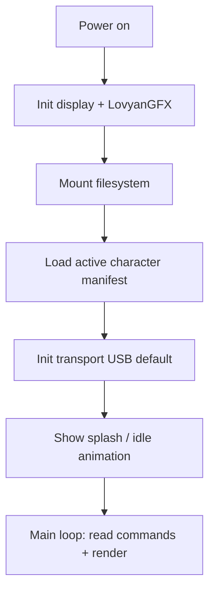

# Firmware

> **Status:** Design specification - implementation not yet started.

## Purpose

ESP32 firmware is NomaBot's **render plane**. It receives JSON commands, composes sprite layers, drives the display via LovyanGFX, and manages local asset storage. It does not implement product integrations or AI.

## Design philosophy

The firmware stays **small, predictable, and OTA-friendly**:

```text
✓  Parse protocol commands
✓  Load sprites from flash / SD (if present)
✓  Run animation state machine
✓  Composite layers each frame
✓  Report status and accept OTA

✗  Git, Spotify, VS Code, calendars, cloud APIs
✗  Plugin or character pack business logic beyond asset loading
```

If a feature requires knowing *what VS Code is*, it belongs in the desktop app.

## Technology stack

| Component | Choice | Notes |
|-----------|--------|-------|
| Platform | ESP32 (see [Hardware](./09_HARDWARE.md)) | Wi-Fi + USB serial capable variants |
| Framework | Arduino for ESP32 | Faster bring-up than ESP-IDF for this project |
| Display | **Renderer abstraction** → LovyanGFX backends | ST7789 default; OLED/AMOLED ports |
| Animation | Animation graph engine | State machine + crossfade blends |
| Storage | SPIFFS / LittleFS | On-flash assets; optional SD for large packs |
| OTA | AsyncElegantOTA or ESP native OTA | Signed images in production |
| Protocol | JSON over serial / TCP | Same schema as [Communication](./04_COMMUNICATION.md) |

## Module structure (target)

```text
firmware/
├── src/
│   ├── main.cpp              # Setup, loop, watchdog
│   ├── protocol/             # JSON parse, command dispatch
│   ├── animation/            # Graph engine + layer compositor
│   ├── renderer/             # Renderer abstraction (ST7789, OLED, …)
│   ├── display/              # Board config, backlight
│   ├── assets/               # Pack loader, cache
│   ├── transport/            # Transport adapters (bytes → parser)
│   └── ota/                  # Update handler
├── lib/
│   └── animation_engine/     # Layer compositor (shared with docs spec)
└── data/                     # Default embedded assets (optional)
```

## Boot sequence



1. Hardware init (display, backlight, optional SD)
2. Mount flash filesystem; validate `active_character.json`
3. Start default transport (USB serial at 115200 baud unless configured)
4. Enter render loop at target FPS (typically 15–30 FPS depending on panel)

## Command dispatch

Incoming JSON maps to internal handlers. All commands share envelope fields (`v`, `id`, `cmd`, `params`).

| Command | Handler responsibility |
|---------|------------------------|
| `play_animation` | Select clip, reset frame index, optional loop |
| `show_message` | Render bubble layer with text (font cache) |
| `set_accessory` | Swap accessory sprite set |
| `set_background` | Swap background layer |
| `set_effect` | Enable/disable effect layer (rain, shadow, …) |
| `show_notification` | Short banner + optional sound |
| `load_character` | Switch pack from flash or staged upload |
| `set_state` | Apply animation graph event (`event.typing`, …) |
| `sync_begin` / `sync_chunk` / … | Chunked asset upload (see below) |
| `ping` | Respond with `pong` + firmware version |
| `get_status` | Memory, FPS, active character, transport |

Unknown commands return structured errors without resetting state.

## Renderer abstraction

Firmware must not hard-code ST7789 calls throughout the animation engine. Use a **Renderer interface**:

```text
Renderer Interface
├── St7789Renderer     ← reference 240×240 SPI (LovyanGFX)
├── OledRenderer       ← monochrome panels
├── AmoledRenderer     ← high-DPI variants
└── HdmiRenderer       ← future SBC / port targets
```

```cpp
// Conceptual - firmware/src/renderer/renderer.hpp
class Renderer {
 public:
  virtual void beginFrame() = 0;
  virtual void blit(const Sprite& sprite, int x, int y) = 0;
  virtual void fillRect(int x, int y, int w, int h, Color c) = 0;
  virtual void endFrame() = 0;
  virtual int width() const = 0;
  virtual int height() const = 0;
};
```

Animation engine draws to a logical framebuffer; `St7789Renderer` (etc.) flushes via LovyanGFX. New hardware = new renderer backend, not a fork of the graph engine.

See [Firmware SDK](./12_SDK.md#firmware-sdk).

## Animation engine integration

Firmware embeds the **animation graph** and layer compositor from [Animation Engine](./05_ANIMATION_ENGINE.md):

```text
Frame loop:
  1. Evaluate graph transitions (timeouts, events, blends)
  2. Advance clip frame clocks
  3. Resolve layer stack (background → character → accessory → bubble → effects)
  4. Blit via Renderer abstraction
  5. endFrame() flush
```

Animations are **data**: frame lists, timing, and pivot points live in character packs, not in C++ switch statements.

## Asset storage

### On-device layout

```text
/characters/
└── nomabot/
    ├── config.json
    ├── metadata.json
    ├── sprites/
    └── animations/
```

### Loading strategy

| Strategy | When |
|----------|------|
| Pre-flash default pack | Factory / first flash |
| USB asset sync | Desktop pushes pack chunks (roadmap milestone) |
| OTA asset bundle | Separate asset partition update |

Keep hot paths in RAM: active sprite sheets, current animation frames. Evict LRU caches under memory pressure.

## Transport layer

Transport adapters feed a common byte stream into the protocol parser:

```text
UsbTransport    ──┐
WifiTransport   ──├──► Ring buffer ──► JsonStreamParser ──► Dispatcher
MqttTransport   ──┘
```

Switching transport is a **runtime config change** (`set_transport` command or GPIO-held boot mode)-no reflash required.

Default baud: **115200** USB serial. WebSocket: desktop acts as client or soft-AP portal during setup (TBD in hardware milestone).

## Performance targets

| Metric | Target |
|--------|--------|
| Frame rate | ≥ 20 FPS on reference hardware |
| Command latency | < 50 ms USB for simple state change |
| Boot to idle | < 3 s |
| Heap headroom | ≥ 20% free under nominal load |

Profile with ESP32 heap tracing before adding features.

## OTA updates

Production OTA requirements:

1. **Signed** firmware binaries
2. **Version** check against desktop-reported compatibility
3. **Rollback** partition or backup slot
4. Progress events sent to desktop during update

Development may use AsyncElegantOTA web UI on local Wi-Fi; release builds use desktop-initiated OTA over the same JSON channel.

## Watchdog and recovery

- Task watchdog enabled for render loop stalls
- Corrupt filesystem → safe mode: solid color + `error` status over serial
- Repeated parse errors → rate-limited error responses, no reboot loop

## Debugging

| Method | Use |
|--------|-----|
| USB serial log | Structured log lines (JSON or tagged text) |
| Desktop debug panel | Mirror firmware logs when connected |
| GPIO test mode | Cycle test pattern without desktop |

## Testing

| Level | Approach |
|-------|----------|
| Protocol | Host-side JSON fixtures fed to parser unit tests |
| Rendering | Screenshot hash tests on emulator / recorded frames |
| Hardware | Manual checklist on reference board |
| OTA | Staged update on bench device before release |

## Related documentation

- [Architecture](./01_ARCHITECTURE.md)
- [Communication](./04_COMMUNICATION.md)
- [Animation Engine](./05_ANIMATION_ENGINE.md)
- [Character System](./06_CHARACTER_SYSTEM.md)
- [Hardware](./09_HARDWARE.md)
