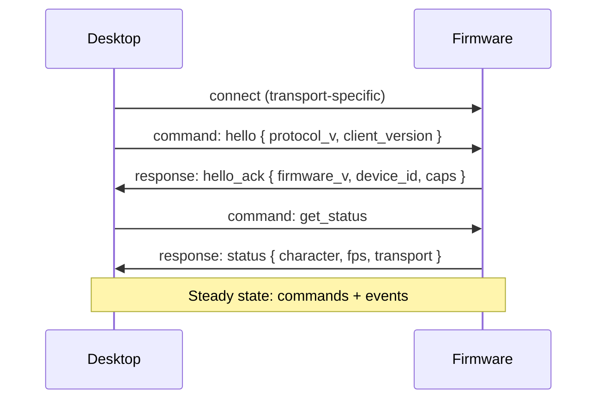

# Communication

> **Status:** Design specification - protocol subject to revision before v1.

## Overview

NomaBot uses a **single JSON protocol** across all transports. The desktop serializes commands; firmware parses and executes them. Responses and events use the same envelope shape.

Supported transports (in rollout order):

```text
1. Serial (USB CDC / UART)   ← MVP
2. WebSocket                 ← wireless desk mode
3. MQTT                      ← home automation
4. BLE                       ← future
5. TCP                       ← raw socket fallback
```

Changing transport must **not** require firmware protocol changes-only a transport adapter that delivers bytes to the JSON parser.

## Transport interface

Desktop and firmware mirror the same adapter pattern:

```text
Transport Interface
├── SerialTransport
├── WebSocketTransport
├── MqttTransport
├── BleTransport      (future)
└── TcpTransport      (future)
```

Firmware `transport/` modules push incoming bytes into a ring buffer; `protocol/` parses NDJSON or framed JSON identically for all transports. Desktop `DeviceManager` binds one transport instance per registered device.

## Design goals

| Goal | How |
|------|-----|
| Human-readable | JSON lines or framed JSON |
| Extensible | Unknown fields ignored; version field required |
| Idempotent where possible | Command `id` for deduplication |
| Debuggable | Loggable one-line messages |
| Low overhead | Compact keys in hot paths optional later |

## Message envelope

Every message is a JSON object:

```json
{
  "v": 1,
  "id": "550e8400-e29b-41d4-a716-446655440000",
  "type": "command",
  "cmd": "play_animation",
  "params": {
    "animation": "coding",
    "loop": true
  }
}
```

### Common fields

| Field | Type | Required | Description |
|-------|------|----------|-------------|
| `v` | integer | yes | **Protocol version** - required on every message (currently `1`) |
| `id` | string | yes | UUID for request/response correlation |
| `type` | string | yes | `command`, `response`, `event`, or `error` |
| `cmd` | string | commands | Command name |
| `params` | object | optional | Command-specific payload |
| `ok` | boolean | responses | Success flag |
| `data` | object | optional | Response or event payload |
| `error` | object | errors | `code`, `message`, optional `details` |

### Versioning

- Increment `v` only on breaking changes
- Firmware and desktop negotiate max supported version on connect
- Unsupported `v` → `error` with code `unsupported_version`

## Framing

### USB Serial

**Newline-delimited JSON (NDJSON):** one JSON object per line, UTF-8, terminated with `\n`.

```
{"v":1,"id":"...","type":"command","cmd":"ping","params":{}}
```

Maximum line length: **16 KB** (configurable). Overflow → `error` / disconnect policy on desktop.

Default baud rate: **115200 8N1**.

### WebSocket

Binary or text frames containing a **single JSON object** (no NDJSON inside a frame). Desktop opens `ws://<device-host>:<port>/v1` (exact path TBD).

### MQTT

Topic layout (proposal):

```text
nomabot/{device_id}/command     # desktop → device
nomabot/{device_id}/response    # device → desktop
nomabot/{device_id}/event       # device → desktop (async)
```

Payload: same JSON envelope. QoS 1 for commands.

## Connection lifecycle



### `hello` / `hello_ack`

Desktop sends:

```json
{
  "v": 1,
  "id": "...",
  "type": "command",
  "cmd": "hello",
  "params": {
    "client_version": "0.1.0",
    "protocol_max": 1
  }
}
```

Firmware responds with capabilities:

```json
{
  "v": 1,
  "id": "...",
  "type": "response",
  "ok": true,
  "data": {
    "firmware_version": "0.1.0",
    "device_id": "esp32-abc123",
    "display": { "width": 240, "height": 240 },
    "caps": ["play_animation", "show_message", "ota"]
  }
}
```

## Command reference

### Rendering

#### `play_animation`

```json
{
  "cmd": "play_animation",
  "params": {
    "animation": "coding",
    "loop": true,
    "transition": "instant"
  }
}
```

| Param | Type | Description |
|-------|------|-------------|
| `animation` | string | Animation id from active character pack |
| `loop` | boolean | Default `true` |
| `transition` | string | `instant` or `crossfade` (if supported) |

#### `show_message`

```json
{
  "cmd": "show_message",
  "params": {
    "text": "Building...",
    "style": "speech",
    "duration_ms": 5000
  }
}
```

| Param | Type | Description |
|-------|------|-------------|
| `text` | string | UTF-8 display text |
| `style` | string | `speech`, `thought`, `banner` |
| `duration_ms` | integer | `0` = until next message |

#### `set_accessory`

```json
{
  "cmd": "set_accessory",
  "params": { "accessory": "laptop" }
}
```

Use `"accessory": null` to clear.

#### `set_background`

```json
{
  "cmd": "set_background",
  "params": { "background": "office" }
}
```

#### `set_effect`

```json
{
  "cmd": "set_effect",
  "params": {
    "effect": "rain",
    "enabled": true,
    "intensity": 0.5
  }
}
```

#### `show_notification`

```json
{
  "cmd": "show_notification",
  "params": {
    "title": "Break time",
    "body": "Stand up!",
    "icon": "bell",
    "duration_ms": 3000
  }
}
```

### Character and assets

#### `load_character`

```json
{
  "cmd": "load_character",
  "params": { "character_id": "nomabot" }
}
```

#### Asset streaming

Chunked upload for large compiled packs. Full pipeline: [Asset Pipeline](./11_ASSET_PIPELINE.md).

##### `sync_begin`

```json
{
  "cmd": "sync_begin",
  "params": {
    "pack_id": "coding_cat",
    "version": "1.0.0",
    "total_bytes": 524288,
    "chunk_size": 4096,
    "manifest_hash": "sha256:…"
  }
}
```

Response includes `resume_offset` if a partial staging session exists.

##### `sync_chunk`

```json
{
  "cmd": "sync_chunk",
  "params": {
    "pack_id": "coding_cat",
    "offset": 0,
    "data_b64": "…",
    "chunk_hash": "sha256:…"
  }
}
```

##### `sync_verify`

Validates staged bytes against `manifest_hash`. Returns `{ "ok": true }` or detailed mismatch.

##### `sync_activate`

Atomically switches active character to staged pack after successful verify.

##### `sync_abort`

Discards staged data; device keeps current active pack.

| Step | Failure behavior |
|------|------------------|
| Chunk hash mismatch | Retry chunk; after N failures → `sync_abort` |
| Disconnect mid-sync | Resume from last acked offset on reconnect |
| Verify fail | No activation; staging partition wiped |

### System

#### `ping`

```json
{ "cmd": "ping", "params": {} }
```

Response: `{ "ok": true, "data": { "pong": true } }`

#### `get_status`

Returns FPS, free heap, active character, transport, errors.

#### `set_transport`

```json
{
  "cmd": "set_transport",
  "params": { "transport": "websocket", "config": { "port": 8080 } }
}
```

#### `ota_begin` / `ota_chunk` / `ota_commit` (future)

Desktop-driven firmware update stream.

## Events (device → desktop)

Async messages with `"type": "event"`:

| Event | When |
|-------|------|
| `button_pressed` | Optional physical button |
| `touch` | If touch panel present |
| `ota_progress` | During firmware update |
| `error` | Recoverable device-side fault |
| `log` | Forwarded debug line |

Example:

```json
{
  "v": 1,
  "id": "...",
  "type": "event",
  "cmd": "log",
  "data": { "level": "warn", "message": "Sprite cache evicted" }
}
```

## Error codes

| Code | Meaning |
|------|---------|
| `parse_error` | Invalid JSON |
| `unsupported_version` | Protocol mismatch |
| `unknown_command` | Command not implemented |
| `invalid_params` | Schema validation failed |
| `not_ready` | Device busy (OTA, loading character) |
| `asset_missing` | Animation or sprite not found |
| `internal_error` | Unexpected firmware fault |

Error response shape:

```json
{
  "v": 1,
  "id": "...",
  "type": "error",
  "ok": false,
  "error": {
    "code": "asset_missing",
    "message": "Animation 'fly' not found in pack 'nomabot'"
  }
}
```

## Desktop command queue

The communication layer should:

1. Queue commands when disconnected (bounded queue, drop oldest or coalesce render commands)
2. Coalesce redundant `play_animation` / `set_background` when possible
3. Retry `ping` on timeout with exponential backoff
4. Correlate responses by `id`; timeout → surface `device.*` event on bus

## Security notes

| Transport | Recommendation |
|-----------|----------------|
| USB | Trust on first attach; optional device serial whitelist |
| WebSocket | Local network only by default; TLS optional |
| MQTT | Authenticated broker; ACL per device topic |

Never send API keys or secrets through device commands.

## Related documentation

- [Architecture](./01_ARCHITECTURE.md)
- [Firmware](./03_FIRMWARE.md)
- [Desktop App](./02_DESKTOP_APP.md)
- [Roadmap](./10_ROADMAP.md)
