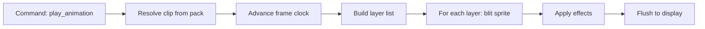

# Animation Engine

> **Status:** Design specification - shared concept for firmware and asset authoring.

## Overview

The animation engine is NomaBot's **sprite compositor and playback system**. It turns layered assets and timing data into frames on the ESP32 display. It is deliberately separate from character identity and from desktop business logic.

```text
Character pack (data)
        │
        ▼
Animation Engine (runtime)
        │
        ├── Layer stack resolution
        ├── Frame timing & state machine
        ├── Blitting (LovyanGFX)
        └── Effects (optional shaders / particles)
        │
        ▼
    Display framebuffer
```

Hardcoding animations in firmware is **not allowed**. New behavior ships as pack data.

## Layer model

Every frame is composed from ordered layers (back to front):

```text
┌─────────────────────────────────────┐
│  Effects (rain, particles, shadow)│  ← optional, can be multiple
├─────────────────────────────────────┤
│  Bubble (speech / thought)          │  ← optional
├─────────────────────────────────────┤
│  Accessory (laptop, coffee, …)      │  ← optional, can swap independently
├─────────────────────────────────────┤
│  Character body (animation frames)  │  ← required
├─────────────────────────────────────┤
│  Background (scene)                 │  ← optional
└─────────────────────────────────────┘
```

Example composition:

```text
Robot + Laptop + Coffee + Rain + Speech bubble + Drop shadow
```

Tomorrow, replace `Robot` with `Panda` by swapping the character pack-**no engine code change**.

## Core concepts

| Concept | Description |
|---------|-------------|
| **Sprite** | Bitmap or sprite sheet region with optional pivot |
| **Animation** | Named sequence of frames + timing + loop rules |
| **Clip** | Runtime instance of an animation (current frame, clock) |
| **Layer** | Drawable slot with z-order and visibility |
| **State** | High-level mode (idle, coding, listening, …) mapping to animations |
| **Effect** | Procedural or sprite-based overlay (not always sheet-based) |

## Animation definition (pack data)

Animations live in character packs under `animations/`. Conceptual JSON schema:

```json
{
  "id": "coding",
  "fps": 12,
  "loop": true,
  "frames": [
    { "sprite": "body/coding_01", "duration_ms": 83 },
    { "sprite": "body/coding_02", "duration_ms": 83 }
  ],
  "on_complete": null,
  "default_accessory": "laptop"
}
```

### Fields

| Field | Description |
|-------|-------------|
| `id` | Stable identifier referenced by commands |
| `fps` | Default frames per second if `duration_ms` omitted |
| `loop` | Repeat after last frame |
| `frames` | Ordered keyframes |
| `on_complete` | Next animation id when `loop: false` |
| `default_accessory` | Optional accessory applied when animation starts |

Sprite references resolve against the pack's `sprites/` manifest (see [Character System](./06_CHARACTER_SYSTEM.md)).

## Animation graph

Do **not** rely on hard cuts (`idle → coding → sleep` only). Each character ships an **animation graph**: a state machine with explicit transitions-similar in spirit to Unreal Engine Animation Blueprints.

```text
       ┌──────┐
 ┌────►│ Idle │◄────┐
 │     └──┬───┘     │
 │        │ typing_detected
 │        ▼         │
 │   ┌─────────┐    │ pause
 │   │ Typing  │────┘
 │   └────┬────┘
 │        │ idle_timeout (5s)
 │        ▼
 │   ┌──────────┐
 └───│ Thinking │
     └────┬─────┘
          │ success
          ▼
     ┌─────────┐
     │  Happy  │──crossfade──► Idle
     └─────────┘

Idle ──(no_input 300s)──► Sleep
```

### `animation_graph.json`

```json
{
  "default_state": "idle",
  "states": {
    "idle": {
      "animation": "idle",
      "transitions": [
        { "to": "typing", "on": "event.typing", "blend_ms": 150 },
        { "to": "sleep", "on": "timeout", "after_ms": 300000, "blend_ms": 500 }
      ]
    },
    "typing": {
      "animation": "coding",
      "accessory": "laptop",
      "transitions": [
        { "to": "thinking", "on": "timeout", "after_ms": 5000, "blend_ms": 200 },
        { "to": "idle", "on": "event.idle", "blend_ms": 150 }
      ]
    },
    "thinking": {
      "animation": "think",
      "transitions": [
        { "to": "happy", "on": "event.success", "blend_ms": 100 },
        { "to": "idle", "on": "event.cancel", "blend_ms": 150 }
      ]
    },
    "happy": {
      "animation": "celebrate",
      "transitions": [
        { "to": "idle", "on": "clip_complete", "blend_ms": 200 }
      ]
    },
    "sleep": {
      "animation": "sleep",
      "transitions": [
        { "to": "idle", "on": "event.wake", "blend_ms": 400 }
      ]
    }
  }
}
```

### Transition rules

| Field | Description |
|-------|-------------|
| `on` | Trigger: `event.*`, `timeout`, `clip_complete`, `command` |
| `blend_ms` | Crossfade duration between clips |
| `after_ms` | For `timeout` triggers |
| `condition` | Optional expression (future) |

The desktop may send `set_state` or discrete events (`event.typing`); firmware evaluates the graph locally for smooth blends. Author graphs in the **Character Editor** ([Asset Pipeline](./11_ASSET_PIPELINE.md)), not by hand in production.

## Accessory system

Accessories are **independent layers** keyed by id:

```json
{
  "accessories": {
    "laptop": {
      "sprite": "accessories/laptop",
      "anchor": "hands",
      "offset": { "x": 0, "y": 2 }
    },
    "coffee": {
      "sprite": "accessories/coffee",
      "anchor": "desk",
      "offset": { "x": 40, "y": 50 }
    }
  }
}
```

Anchors attach to defined points on the character skeleton (or bounding box corners): `hands`, `head`, `desk`, etc.

Commands `set_accessory` swap layers without restarting body animation.

## Bubble layer

Text bubbles support:

| Style | Use |
|-------|-----|
| `speech` | Rectangular / rounded speech bubble |
| `thought` | Cloud style |
| `banner` | Full-width lower third |

Rendering uses a **font atlas** shipped with the character pack or a shared system font. Firmware caches glyph layouts; long text wraps or truncates per pack policy.

## Background layer

Backgrounds are full-screen sprites or tiled patterns:

```json
{
  "backgrounds": {
    "office": { "sprite": "bg/office" },
    "night": { "sprite": "bg/night_city", "parallax": false }
  }
}
```

Future: parallax layers as multiple sub-layers.

## Effects

Effects may be:

1. **Sprite-based** - pre-rendered overlay sheets (rain frames)
2. **Procedural** - particles, scrolling noise (limited ESP32 budget)

```json
{
  "effects": {
    "rain": { "type": "particle", "params": { "density": 0.5 } },
    "shadow": { "type": "sprite", "sprite": "fx/shadow", "blend": "multiply" }
  }
}
```

Intensity scales via command params (`set_effect`).

## Runtime pipeline



Per frame (target 16–33 ms budget on reference hardware):

1. Tick all active clips
2. Resolve sprite pointers from cache
3. Clear or blit background
4. Draw character + accessories (respect pivots)
5. Draw bubble if active
6. Draw effects
7. Push framebuffer

## Memory management

| Asset | Policy |
|-------|--------|
| Active animation sheets | Keep in RAM |
| Inactive animations | Load on demand from flash |
| Font glyphs | LRU cache |
| Full pack | Never load entirely if pack exceeds RAM |

Report `asset_missing` errors via protocol when lookup fails.

## Authoring guidelines

For character artists and pack authors:

1. **Power-of-two** sprite dimensions where possible (GPU/driver friendly)
2. Consistent **pivot** across frames of one animation
3. Limit palette and size for target profile (`lilygo_tdisplay_s3` = 170×320)
4. Name ids in **snake_case**, stable across pack versions
5. Provide **idle** animation at minimum 2 frames for life-like feel
6. Test on reference device before publishing pack

Recommended tools: Aseprite, LibreSprite, or Photoshop with consistent export scripts.

## Desktop preview

The Character SDK **PreviewRenderer** (PySide6) uses the same layer rules and animation graph as firmware so authors validate without flashing hardware. See [SDK](./12_SDK.md) and [Asset Pipeline](./11_ASSET_PIPELINE.md).

## Related documentation

- [Character System](./06_CHARACTER_SYSTEM.md)
- [Firmware](./03_FIRMWARE.md)
- [Communication](./04_COMMUNICATION.md)
- [Asset Pipeline](./11_ASSET_PIPELINE.md)
- [SDK](./12_SDK.md)
