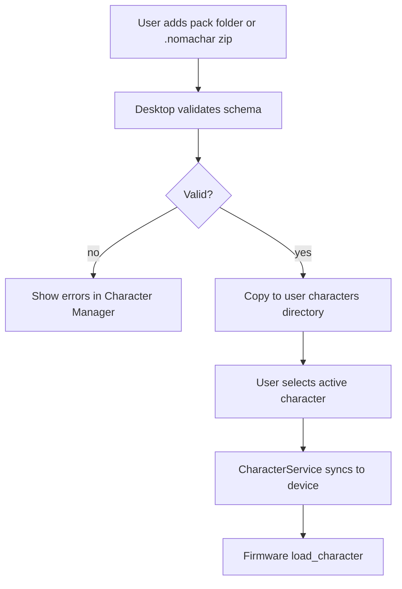

# Character System

> **Status:** Design specification - pack format v1 draft.

## Overview

Characters are **data-driven asset packs**, not firmware features. Installing a character should feel like installing a VS Code theme: drop in a folder, validate, select in the desktop app, sync to device.

```text
characters/
├── nomabot/
├── coding_cat/
├── mini_monk/
├── fox/
└── astronaut/
```

Each pack is self-contained and described by JSON manifests plus sprite assets.

## Pack directory layout

```text
characters/{character_id}/
├── config.json           # Engine config, anchors, display hints
├── metadata.json         # Author, version, license, description
├── animation_graph.json  # State machine + transitions (required)
├── sprites/              # PNG sources (compiled by nomabot build-assets)
│   ├── body/
│   ├── accessories/
│   ├── bg/
│   └── fx/
├── animations/           # One JSON file per animation or single manifest
│   ├── idle.json
│   └── coding.json
├── sounds/               # Optional short FX (future)
│   └── notify.wav
└── preview.png           # Desktop UI thumbnail
```

### `metadata.json`

Human-facing pack information:

```json
{
  "id": "nomabot",
  "name": "NomaBot",
  "version": "1.0.0",
  "author": "NomaBot Project",
  "license": "MIT",
  "description": "Default desk companion robot.",
  "tags": ["robot", "default"],
  "min_firmware": "0.1.0",
  "min_desktop": "0.1.0"
}
```

### `config.json`

Engine-facing configuration:

```json
{
  "id": "nomabot",
  "display": {
    "width": 170,
    "height": 320,
    "profile": "lilygo_tdisplay_s3",
    "default_background": "office"
  },
  "anchors": {
    "hands": { "x": 85, "y": 200 },
    "head": { "x": 85, "y": 80 },
    "desk": { "x": 85, "y": 280 }
  },
  "default_animation": "idle",
  "states": {
    "idle": { "animation": "idle" },
    "coding": { "animation": "coding", "accessory": "laptop" }
  },
  "accessories": {
    "laptop": {
      "sprite": "accessories/laptop",
      "anchor": "hands",
      "offset": { "x": 0, "y": 2 }
    }
  },
  "backgrounds": {
    "office": { "sprite": "bg/office" }
  },
  "effects": {
    "shadow": { "type": "sprite", "sprite": "fx/shadow" }
  }
}
```

See [Animation Engine](./05_ANIMATION_ENGINE.md) for animation file format.

## Personality

Characters are not only sprites-they have **personality** metadata that drives message tone, AI system prompts, scheduler templates, and UX restraint ([UX](./15_UX.md)).

### `personality.yaml` (or block in `metadata.json`)

```yaml
id: nomabot
traits:
  - friendly
  - curious
  - encouraging
voice:
  tone: warm
  verbosity: low          # low | medium - never spam
  humor: rare             # rare | none | frequent
  panic: never            # never panic the user
quirks:
  - loves coffee
templates:
  good_morning:
    - "Good morning."
    - "Ready when you are."
  hydration:
    - "Water?"
  build_failed:
    - "That didn't work. Retry?"
ai:
  system_addendum: |
    You are NomaBot, a friendly desk robot. Under 12 words.
    Encouraging, not noisy. Rare gentle humor. Never sarcastic.
```

### Official character personalities (target)

| Character | Traits | Voice |
|-----------|--------|-------|
| **NomaBot** | Friendly, curious, encouraging | Warm; rare jokes; loves coffee |
| **Coding Cat** | Lazy, sarcastic | Dry; sleeps a lot; minimal effort messages |
| **Mini Monk** | Calm, patient | Peaceful wording; never urgent |

Personality feeds:

- **Offline templates** ([Offline Mode](./16_OFFLINE.md))
- **AIService** when AI enabled ([AI](./08_AI.md))
- **Plugin message suggestions** (plugins ask runtime for template key, not raw text)

Validation: `nomabot character validate` warns if personality block missing for official packs.

## Installation flow



### Validation rules

Desktop **CharacterService** (and future SDK CLI) must verify:

| Check | Failure action |
|-------|----------------|
| Required files present | Reject install |
| JSON schema valid | Reject with path to error |
| Sprite references resolve | Reject |
| Animation ids unique | Reject |
| Dimensions within hardware limits | Warn or reject |
| Version compatibility | Warn if `min_firmware` > device |

## Distribution formats

| Format | Description |
|--------|-------------|
| **Folder** | Raw directory in `characters/` |
| **`.nomachar`** (proposed) | Zip archive with manifest at root |
| **Registry** (future) | Community catalog with checksums |

Pack signing for third-party marketplaces is a post-v1 consideration.

## Asset compilation

Source packs are **not** copied raw to ESP32. Authors run:

```bash
nomabot build-assets --input ./characters/nomabot --output ./compiled/nomabot
```

The compiler produces RGB565 binaries, compression, and `manifest.json`. Install compiled output via USB or [chunked streaming](./04_COMMUNICATION.md#asset-streaming). See [Asset Pipeline](./11_ASSET_PIPELINE.md).

Author with the **Character Editor** when possible; validate with `nomabot character validate`.

## Multi-character support

Only **one character is active** on device at a time (RAM constraint). Desktop may keep multiple packs installed and switch with `load_character`.

Character-specific **plugin hints** (optional in metadata):

```json
{
  "plugin_hints": {
    "vscode": { "preferred_state": "coding" },
    "spotify": { "preferred_state": "music" }
  }
}
```

Plugins read hints; they are not enforced by firmware.

## Default and bundled characters

| Pack | Role |
|------|------|
| `nomabot` | Default shipping character |
| Others | Community / optional downloads |

Bundled packs live in `assets/characters/` in the repository; user packs live in `%APPDATA%/NomaBot/characters/`.

## Versioning and updates

Semantic versioning per pack:

- **Patch** - sprite fixes, same ids
- **Minor** - new animations or accessories, backward compatible
- **Major** - renamed ids or schema break (requires desktop migration notes)

Firmware caches pack version in status; desktop can prompt when updates available.

## Character SDK (tools)

The `sdk/character/` directory (future) will provide:

| Tool | Purpose |
|------|---------|
| `validate` | Schema + reference checker |
| `convert` | PNG → device sprites |
| `preview` | Desktop animation preview |
| `pack` | Build `.nomachar` archive |
| `init` | Scaffold new pack from template |

Template scaffold:

```bash
# Future CLI
noma-character init my_fox --template fox
```

## Licensing

Each pack must declare a `license` in `metadata.json`. The NomaBot project recommends **MIT** or **CC BY-SA** for community packs. Do not redistribute copyrighted characters without rights.

## Related documentation

- [Animation Engine](./05_ANIMATION_ENGINE.md)
- [Firmware](./03_FIRMWARE.md)
- [Desktop App](./02_DESKTOP_APP.md)
- [Plugin System](./07_PLUGIN_SYSTEM.md)
