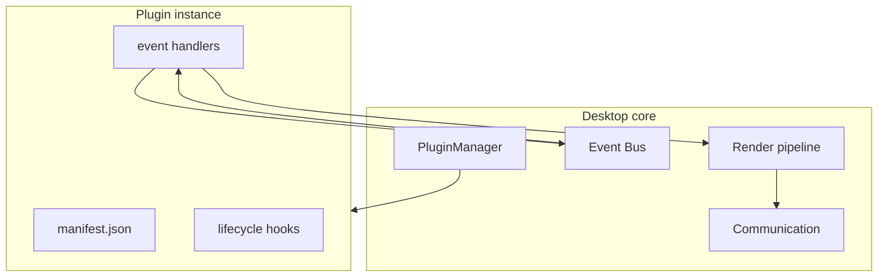

# Plugin System

> **Status:** Design specification - SDK interfaces subject to stabilization in milestone 4.

## Overview

Everything beyond core connectivity, rendering, settings, and character management is a **plugin**. Plugins keep the desktop application lightweight while allowing the ecosystem to grow (GitHub, Discord, Spotify, VS Code, Docker, Home Assistant, FynOS, etc.).

```text
Core (shipped with NomaBot)
  Activity detection · Device comm · Character loader · Settings · Tray

Plugins (bundled optional + user-installed)
  Git · Spotify · VS Code · Slack · Jira · OBS · ...
```

Plugins **never** talk to the ESP32 directly. They publish events and render requests; core services and the communication layer handle the device.

## Architecture



## Plugin manifest

Each plugin is a directory with `manifest.json`:

```json
{
  "id": "com.nomabot.plugin.git",
  "name": "Git Status",
  "version": "1.0.0",
  "description": "Shows branch and dirty state when a git repo is active.",
  "author": "NomaBot Project",
  "license": "MIT",
  "min_desktop": "0.2.0",
  "entry": "plugin:GitPlugin",
  "permissions": [
    "filesystem.read",
    "internet",
    "git",
    "notifications"
  ],
  "settings_schema": {
    "show_branch": { "type": "boolean", "default": true }
  },
  "subscriptions": [
    "activity.changed",
    "git.repo.changed"
  ]
}
```

### Required fields

| Field | Description |
|-------|-------------|
| `id` | Reverse-DNS unique identifier |
| `name` | Display name |
| `version` | Semver |
| `entry` | Python module path `module:Class` |
| `permissions` | Capabilities requested (enforced) |
| `subscriptions` | Event topics plugin handles |

## Lifecycle

| Phase | Hook | Responsibility |
|-------|------|----------------|
| Discovery | - | PluginManager scans paths |
| Load | `on_load()` | Import module, validate manifest |
| Enable | `on_enable()` | Subscribe to events, init resources |
| Settings change | `on_settings_changed()` | React to user config |
| Disable | `on_disable()` | Unsubscribe, release handles |
| Unload | `on_unload()` | Final cleanup |

Failed `on_enable()` disables plugin for session and logs error-core must remain stable.

## Plugin API (conceptual)

```python
# sdk/plugin/base.py - conceptual, not yet implemented

class Plugin(ABC):
    manifest: PluginManifest

    def on_load(self, context: PluginContext) -> None: ...
    def on_enable(self) -> None: ...
    def on_disable(self) -> None: ...
    def on_event(self, event: Event) -> None: ...

class PluginContext:
    event_bus: EventBus
    settings: SettingsStore
    logger: Logger

    def request_render(self, spec: RenderSpec) -> None: ...
    def emit(self, topic: str, payload: dict) -> None: ...
```

### RenderSpec

Plugins describe desired device state abstractly:

```python
@dataclass
class RenderSpec:
    device_id: str | None = None   # None = default device
    animation: str | None = None
    accessory: str | None = None
    background: str | None = None
    message: MessageSpec | None = None
    effect: EffectSpec | None = None
    priority: Priority = Priority.NORMAL
```

`Priority` enum: `CRITICAL`, `HIGH`, `NORMAL`, `LOW`, `BACKGROUND`.

Core **Noma Runtime** translates `RenderSpec` → JSON commands ([Communication](./04_COMMUNICATION.md)).

## Permissions model

Plugins declare **capabilities** in plain language. Core maps them to enforced gates before enable:

```json
{
  "permissions": [
    "filesystem.read",
    "filesystem.write",
    "internet",
    "git",
    "notifications",
    "ai.query",
    "scheduler.register"
  ]
}
```

Users see a human-readable permission summary in Settings → Plugins before enabling.

| Permission | Grants |
|------------|--------|
| `filesystem.read` | Read scoped paths via platform APIs (not raw disk) |
| `filesystem.write` | Plugin data directory only |
| `internet` | Outbound HTTP/WebSocket (Spotify, APIs) |
| `git` | Git metadata via GitService / scoped repo read |
| `notifications` | OS notifications + device `show_notification` |
| `ai.query` | AIService completions |
| `scheduler.register` | Register cron jobs with SchedulerService |
| `render` | Call `context.runtime.submit()` - implicit for plugins |
| `default_priority` | Optional manifest default: `NORMAL`, `LOW`, etc. |

Plugins without a declared permission get `PermissionError` at runtime. Bundled plugins undergo stricter review.

See also [SDK - Plugin permissions](./12_SDK.md#plugin-sdk).

## Bundled vs user plugins

| Location | Purpose |
|----------|---------|
| `desktop/plugins/` | Official bundled plugins (git, spotify, vscode, …) |
| `%APPDATA%/NomaBot/plugins/` | User-installed third-party |
| Dev mode | `--plugin-path` for local development |

## Example: Git plugin behavior

1. Subscribe to `activity.changed`
2. When foreground app is an IDE, ask `GitService` for repo root
3. On branch or dirty state change, emit render request:
   - Animation: `coding`
   - Message: `"main · 3 files changed"` (optional)
4. Coexist with other plugins via priority rules

## Example: Spotify plugin behavior

1. Requires `network.http` permission
2. Poll or webhook Spotify API for now playing
3. Request animation `music` + accessory `headphones`
4. Optional message: track title (truncated)

## Coexistence and priority

When multiple plugins request render changes:

1. Sort by `priority` (plugin-defined per request)
2. Merge non-conflicting layers (accessory from A, message from B)
3. Last-writer-wins for same layer if priorities equal
4. User can pin a plugin "always override" in settings (future)

Document default priorities in plugin authoring guide.

## Plugin settings

Settings defined in `settings_schema` appear in Settings → Plugins → [Plugin name]. Stored in SQLite keyed by plugin id.

Validation runs before `on_settings_changed`.

## Development workflow

```text
1. noma-plugin init my_integration   # future SDK
2. Implement Plugin subclass
3. Run desktop with --plugin-path ./my_integration
4. Unit test handlers with mock EventBus
5. Submit PR or publish to community registry (future)
```

## Testing requirements

Contributed plugins should include:

- Manifest validation test
- Handler unit tests with fixture events
- No network in default CI (mock APIs)

## Security

| Risk | Mitigation |
|------|------------|
| Malicious plugin | Permission prompts; code review for bundled; optional signing later |
| Secret exfiltration | No raw filesystem; network permission explicit |
| Render spam | Rate limit `request_render` per plugin |

## Planned official plugins

Non-exhaustive roadmap list:

| Plugin | Integration |
|--------|-------------|
| Git | Branch, dirty files |
| GitHub | PR checks, notifications |
| VS Code / IntelliJ | Active coding state |
| Spotify | Now playing |
| Discord / Slack | Status (respecting privacy) |
| Jira | Active ticket |
| Steam | Game running |
| OBS | Recording indicator |
| Docker | Container activity |
| Home Assistant | Entity states |
| FynOS | Platform-specific hooks |

Priority order in [Roadmap](./10_ROADMAP.md).

## Related documentation

- [Desktop App](./02_DESKTOP_APP.md)
- [AI](./08_AI.md)
- [Communication](./04_COMMUNICATION.md)
- [Contributing](./CONTRIBUTING.md)
