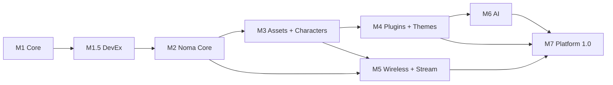

# Roadmap

> **Status:** Living document - milestones reflect planned delivery order, not fixed dates.

## Philosophy

NomaBot is a **platform first**. Stabilize protocol version (`"v": 1`), asset compiler, animation graph, transport interface, and SDK contracts before scaling integrations or marketplace features.

```text
Protocol + renderer  →  Noma Core desktop  →  Asset pipeline  →  Characters
    →  Plugins + Scheduler  →  Wireless + streaming  →  AI  →  SDK / Store / 1.0
```

**Do not write application code before:** JSON envelope, pack schema, compiler stub, and renderer abstraction interfaces are documented (done in `docs/`).

## Version strategy

| Label | Meaning |
|-------|---------|
| **0.x** | Pre-release; breaking changes with migration notes |
| **1.0** | Stable protocol, compiler output, plugin SDK, graph schema |
| **1.x+** | Marketplace, BLE transport, extra renderers |

## Repository split

| When | Action |
|------|--------|
| Milestone 2 exit | Extract `nomabot-sdk` (schemas + CLI) if not already split |
| Milestone 3 exit | Extract `nomabot-assets`; CI runs `nomabot build-assets` |
| Milestone 5 exit | Split `nomabot-firmware` release tags |
| 1.0 | Four repos: desktop, firmware, sdk, assets |

See [Platform & Ecosystem](./13_PLATFORM.md).

---

## Milestone 1 - Core

**Goal:** Layered animation + protocol v1 over serial; renderer abstraction stub.

| Deliverable | Details |
|-------------|---------|
| Firmware skeleton | Boot, **Renderer interface**, **LILYGO T-Display S3** backend |
| Animation engine v0 | Layers + simple graph (2–3 states) |
| Serial transport adapter | NDJSON, `"v": 1` on every message |
| Protocol subset | `ping`, `hello`, `play_animation`, `show_message`, `set_background`, `set_state` |
| Compiled default pack | `nomabot` @ **170×320** profile |
| Python protocol stub | Uses future SDK layout |

**Exit criteria**

- [ ] Reference hardware shows blended state change (not hard cut)
- [ ] Round-trip latency < 100 ms USB
- [ ] Test vectors pass in `nomabot-sdk` fixtures

**Target version:** `0.1.0`

---

## Milestone 1.5 - Developer Experience

**Goal:** Tools that pay dividends during all later milestones-build immediately after Core.

| Deliverable | Details |
|-------------|---------|
| `nomabot` CLI skeleton | `protocol lint`, `build-assets` stub |
| **Mock device** | Records commands; no hardware |
| **Desktop emulator** | 170×320 PySide6 window mirroring device |
| Test fixtures | Golden NDJSON in `sdk/firmware/test_vectors/` |
| Host firmware tests | Parser + graph on CI without flash |
| Logging scaffold | File handlers matching production layout |
| ADR + testing docs | This repo's `docs/adr/`, [14_TESTING](./14_TESTING.md) |

**Exit criteria**

- [ ] `pytest sdk/tests` green without hardware
- [ ] Plugin author can loop: event → mock device → assert command
- [ ] Emulator shows animation state for manual QA

**Target version:** `0.1.5`

---

## Recommended implementation order

If starting code tomorrow, follow this sequence (maps to milestones):

| Step | Component |
|------|-----------|
| 1 | Protocol `v1` + test vectors |
| 2 | Renderer abstraction (`lilygo_tdisplay_s3`) |
| 3 | Animation engine + graph |
| 4 | Desktop event bus |
| 5 | **Noma Runtime** + render queue + priority |
| 6 | Device Manager |
| 7 | USB / Serial transport |
| 8 | Asset compiler |
| 9 | Character Editor |
| 10 | First character (NomaBot @ 170×320) |
| 11 | Plugin SDK |
| 12 | Git plugin |
| 13 | VS Code plugin |
| 14 | Wi-Fi + pairing ([Security](./17_SECURITY.md)) |
| 15 | AI integration |

---

## Milestone 2 - Noma Core (Desktop)

**Goal:** PySide6 desktop from day one-modular, not monolithic.

| Deliverable | Details |
|-------------|---------|
| **PySide6 only** | Tray, settings, Qt Designer-no alternate UI toolkit |
| `desktop/core/` | Event bus, **Noma Runtime**, lifecycle |
| **Render queue** | Priority: Critical → Background ([ADR 0005](./adr/0005-event-priority.md)) |
| `SchedulerService` | Central job registry + SQLite persistence |
| `DeviceManager` v0 | Single device; multi-device data model ready |
| `ActivityService` | Foreground window + idle (Windows) |
| Transport layer | `SerialTransport` + interface |
| **Logging** | `desktop.log`, `transport.log`, Log Viewer panel |
| **Offline mode** | USB-complete path ([16_OFFLINE](./16_OFFLINE.md)) |
| Config + SQLite | Devices table, scheduler_jobs |
| Nuitka packaging | Windows `.exe` |

**Exit criteria**

- [ ] Scheduler fires test job → message on device
- [ ] Logs visible in Settings → Logs
- [ ] Services do not cross-import (lint/enforced)

**Target version:** `0.2.0`

---

## Milestone 3 - Asset Pipeline & Characters

**Goal:** Compiler + Character Editor + swappable packs.

| Deliverable | Details |
|-------------|---------|
| `nomabot build-assets` CLI | PNG → RGB565 → manifest |
| Pack format v1 | `animation_graph.json`, metadata, profiles |
| Character Editor v0 | Timeline, graph, preview, export |
| CharacterService | Validate, compile on install |
| Character manager UI | Install, preview, activate |
| `load_character` + graph | Firmware loads compiled bundle |
| `nomabot-assets` repo | `nomabot` + `coding_cat` sources |
| Multi-device v1 | Assign character per device id |

**Exit criteria**

- [ ] Artist workflow: Editor → build → device without hand JSON
- [ ] Second character pack installs on two devices with different assignments

**Target version:** `0.3.0`

---

## Milestone 4 - Plugins & Themes

**Goal:** Integrations and visual themes via SDK.

| Deliverable | Details |
|-------------|---------|
| Plugin SDK + manifest | Permissions: `internet`, `git`, `notifications`, … |
| Plugin lifecycle UI | Permission summary before enable |
| Render coalescing | Priority + `device_id` routing |
| Bundled plugins | Git, Spotify, VS Code |
| **Theme system + Theme Editor** | `nomabot build-theme`, 2 official themes |
| Scheduler integration | Plugins register hydration / standup jobs |

**Exit criteria**

- [ ] Third-party sample plugin via `--plugin-path`
- [ ] Theme changes bubble/notification styling on device

**Target version:** `0.4.0`

---

## Milestone 5 - Wireless & Asset Streaming

**Goal:** Untether USB; resumable large pack upload.

| Deliverable | Details |
|-------------|---------|
| `WebSocketTransport` + `MqttTransport` | Same JSON `"v"` envelope |
| Wi-Fi provisioning | Station + setup UX |
| **Asset streaming** | `sync_begin/chunk/verify/activate/abort` |
| OTA firmware | Signed, progress events |
| `TcpTransport` stub | Interface proven with loopback test |

**Exit criteria**

- [ ] 2 MB pack uploads with simulated disconnect + resume
- [ ] Day-long Wi-Fi operation on reference hardware

**Target version:** `0.5.0`

---

## Milestone 6 - AI

**Goal:** Optional providers; Scheduler + AI smart reminders.

| Deliverable | Details |
|-------------|---------|
| AIService | OpenAI, Gemini, Claude, Ollama, LM Studio |
| Credential storage | OS keychain |
| Privacy tiers | Minimal / standard / extended |
| `ai.query` permission | Plugin + scheduler payloads |
| Template fallback | AI off = deterministic messages |

**Exit criteria**

- [ ] Ollama offline path; no keys on device

**Target version:** `0.6.0`

---

## Milestone 7 - Platform 1.0

**Goal:** Ecosystem-ready; four repos; catalog-ready metadata.

| Deliverable | Details |
|-------------|---------|
| Published `nomabot-sdk` on PyPI | Python + Plugin + Character + Firmware SDK |
| Protocol stability pledge | `v=1` frozen with extension rules |
| **Noma Store index** (JSON) | GitHub Releases–backed catalog |
| Character Editor v1 | Ship with desktop |
| `BleTransport` spike | Optional; not blocking 1.0 |
| Website | Docs mirror, downloads |
| Multi-device polish | Room groups, broadcast messages |

**Exit criteria**

- [ ] External contributor ships pack + plugin using SDK only
- [ ] All `docs/` current; split repos tagging independently

**Target version:** `1.0.0`

---

## Post-1.0 ideas

| Idea | Notes |
|------|-------|
| macOS / Linux desktop | PySide6 |
| Signed store artifacts | Trust tier 2 |
| HDMI / AMOLED renderers | Renderer backends |
| Voice (desktop TTS → bubble) | Device text only |
| Home Assistant integration | MQTT native |

---

## Dependency graph



---

## Related documentation

- [Vision](./00_VISION.md)
- [Architecture](./01_ARCHITECTURE.md)
- [Asset Pipeline](./11_ASSET_PIPELINE.md)
- [Testing Strategy](./14_TESTING.md)
- [Security](./17_SECURITY.md)
- [Contributing](./CONTRIBUTING.md)
